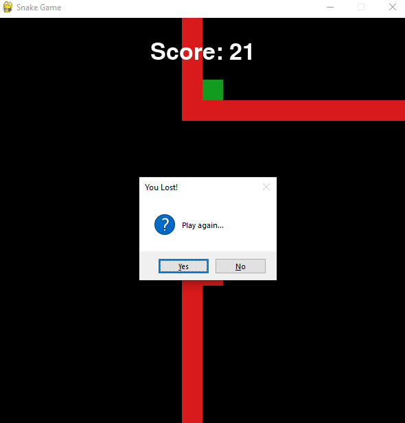

# Snake_Game
The classic Snake Game in PyGame.

## Installation
Install the Pygame library.

```bash
pip install pygame
```

## Running the application
Download the source code from the repository and run the file just as any other Python script (.py) file.

## Screenshots
Game on


Game lost



